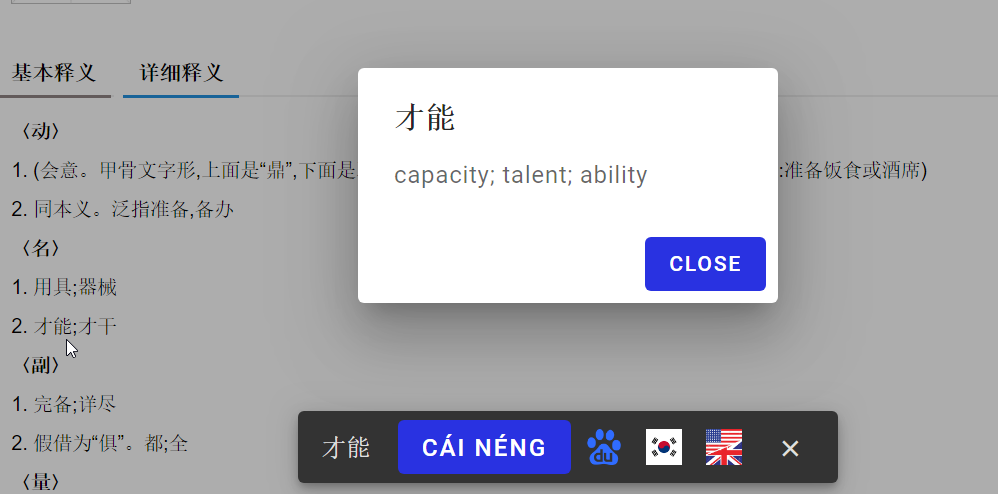

# Baidu Hanyu Lookup Snackbar

Chrome extension that displays a handful snackbar with pronunciation feature and quick dictionaries access when you select a Chinese word in Chrome Browser.

<p align="center">
  
</p>


> ⚠️ This extension is not available on the store because the information used as the data foundation is of private domains. Use for your own education only. You are free to copy and modify the code, but not for a commercial use intention.


## Installation

- clone the repository
- install the dependencies : `npm i`
- build : `npm run build`
- load the folder inside of Chrome (from the extension interface)
- now when you select a chinese word on a webpage the snackbar appears.


# Korean search feature

The korean searching feature won't work because Naver will block cors fetch requests.
In order to use the korean feature you will have to run a local server, type the following in the extension folder :

```node korean-server```

This will run a local server on the port `5000`.
Now it should work.


## Contact

vdegenne (at) gmail (dot) com
